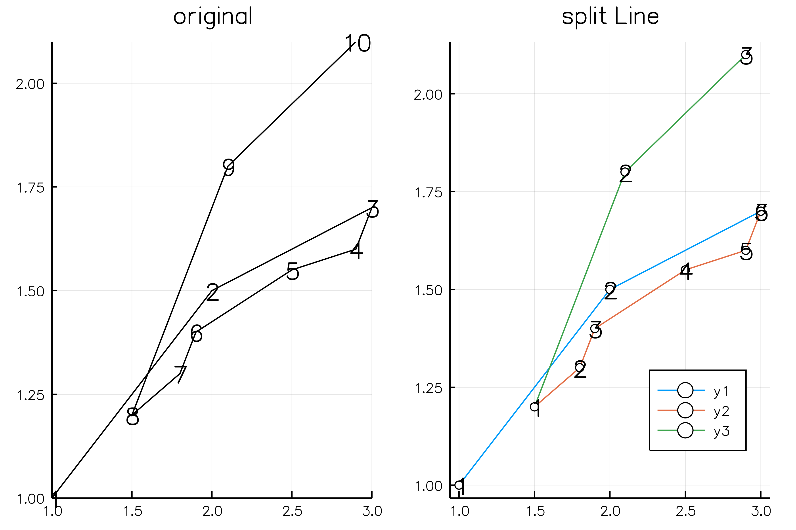
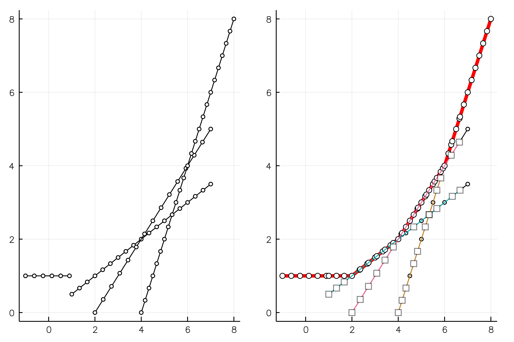
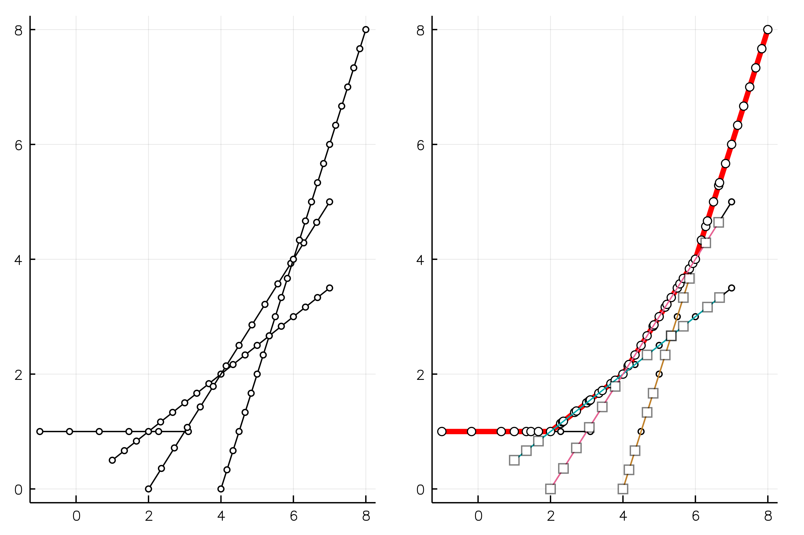
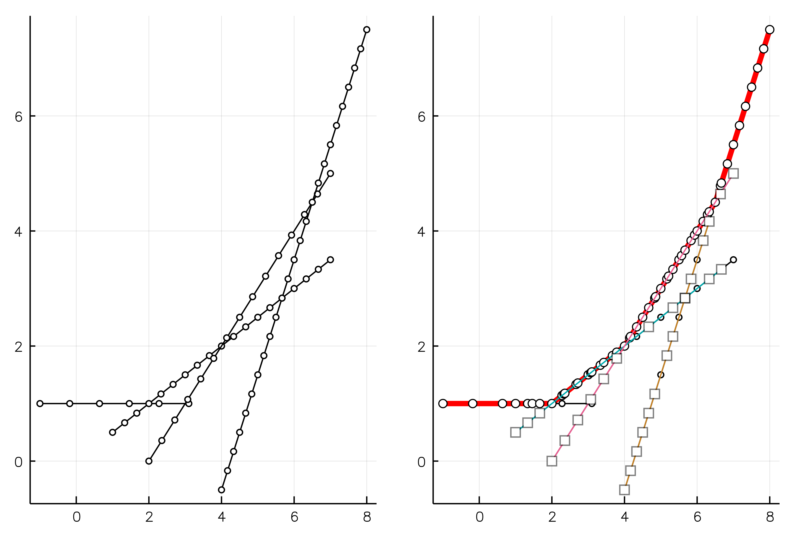
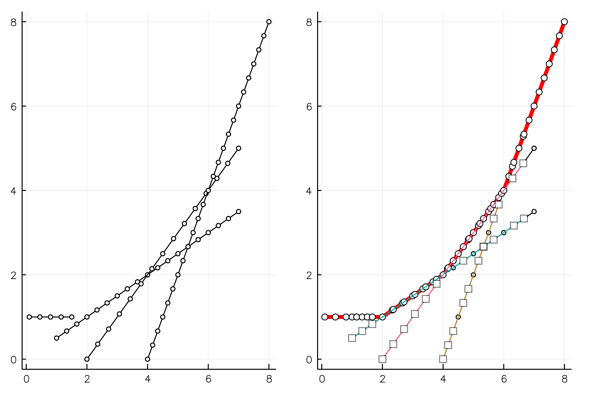

# DCEGM


[](https://travis-ci.org/floswald/DCEGM.jl)

[](https://ci.appveyor.com/project/floswald/dcegm-jl)

[](https://codecov.io/gh/floswald/DCEGM.jl)

Julia implementation of https://github.com/fediskhakov/dcegm


### What it does

Here are some examples of the `Envelope` type. It can split backwards-folding EGM lines and find their upper envelopes.

```julia
# produces below plots
# src/plotting.jl
function splitf3()
    x = [1,2,3,2.9,2.5,1.9,1.8,1.5,2.1,2.9]
    y = [1,1.5,1.7,1.6,1.55,1.4,1.3,1.2,1.8,2.1]
    L = Line(x,y)
    e = splitLine(L)
    upper_env!(e)
    p1 = plot(e,title="upper enveloped")
    removed!(e)
    p2 = plot(e,title="with removed points",removed=true)
    plot(p1,p2)
end
```




## More cases


#### case 2a

#### case 2b

#### case 2c

#### case 3


