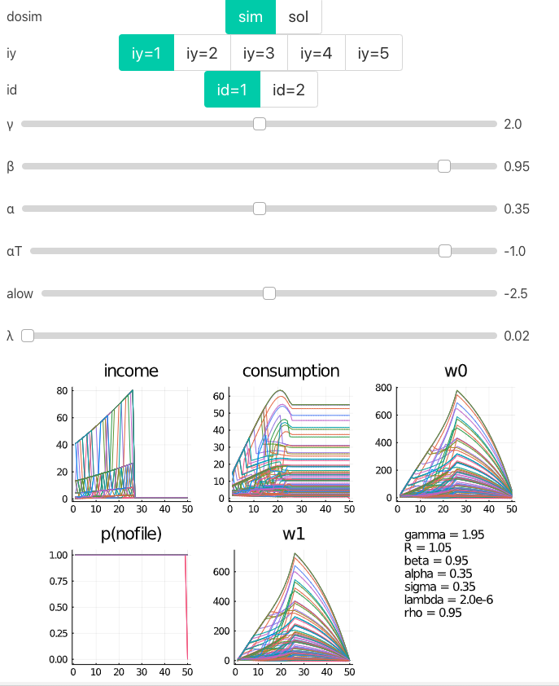
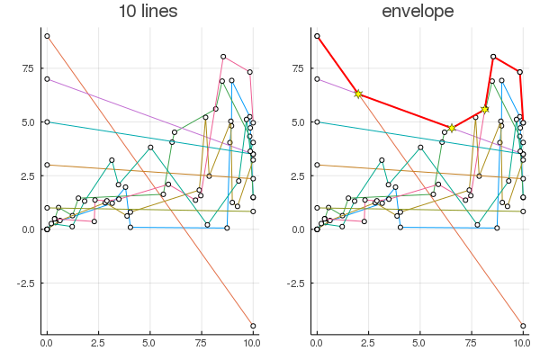
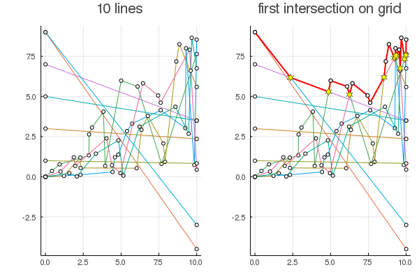

# DCEGM


Julia implementation of DCEGM based on the matlab version at [https://github.com/fediskhakov/dcegm](https://github.com/fediskhakov/dcegm).

This package implements three types of models:

1. `FModel`: Baseline DCEGM version as published in QE paper [and with code here](https://github.com/fediskhakov/dcegm).
2. `GModel`: generalized version of `FModel` with state dependence
3. `BModel`: extension of `GModel` with discrete choice *bankruptcy* instead of labor yes/no.


## How to Use this

1. [Download latest julia](https://julialang.org/downloads/)
2. start julia. you see something like this:
    ```
    ➜  julia
                   _
       _       _ _(_)_     |  Documentation: https://docs.julialang.org
      (_)     | (_) (_)    |
       _ _   _| |_  __ _   |  Type "?" for help, "]?" for Pkg help.
      | | | | | | |/ _` |  |
      | | |_| | | | (_| |  |  Version 1.1.0 (2019-01-21)
     _/ |\__'_|_|_|\__'_|  |  Official https://julialang.org/ release
    |__/                   |

    julia>
    ```
3. Hit the `]` key to switch to package manager mode. the prompt switches to
    ```
    (v1.1) pkg>
    ```
4. Download this package by pasting this into the `(v1.1) pkg>` prompt and hitting enter.
    ```julia
    dev https://github.com/floswald/DCEGM.jl.git
    ```
5. After this is done, hit backspace or `ctrl-c` to go back to standard `julia>` prompt.
    ```julia
    julia> cd(joinpath(DEPOT_PATH[1],"dev","DCEGM"))  # go to the location of DCEGM on your computer
    ```
6. Go back to package mode by typing `]`. then:
    ```julia
    (v1.1) pkg> activate .     # tell pkg manager to modify current directory
    (DCEGM) pkg> instantiate    # download all dependencies
    (DCEGM) pkg> precompile     # precompile package
    ```
7. Done! :tada: Now try it out. Go back to command mode with `ctrl-c`
    ```julia
    julia> using DCEGM

    julia> m,p = DCEGM.runf();  # runs @fediskhakov version of the algorithm
    ```

## How to work with this: workflow

* I don't use `Revise.jl`, instead i
    ```julia
    julia> include("src/DCEGM.jl")
    ```
    each time I made a change to the code. I found it much more robust than `Revise.jl` but maybe that's just me.
* I work mainly in Atom to use the interaction feature (see below) easily
* no pushes into master branch: ideally, changes to code should be made only as a reaction to an issue on the github repo. Therefore, all contributions should be pull requests that are related to one or more issues.
* please give reasonable names to your branches like `issue12` or `multi-dchoice` and not `branch1`, `branch2` etc.
* Each PR ideally augments the set of unit tests (below).
* no PR should be submitted without executing and passing the test suite (below again). Travis-CI is disabled for now (I ran out of free private builds...)


## Testing

The package is thoroughly unit tested. Please run `] test` while in the activated project. The main test concerns the file `test/F_test.jl`, where we test the output of this version against the one obtained from @fediskhakov s matlab version up to numerical accuracy. That is, first we save the value and policy functions from the matlab code to ASCII format on disk, then we compute the julia model, then we compare each computed value and policy function. There are many more tests, though.

```julia
# hit ]
(@v1.4) pkg> activate .
(DCEGM) pkg> test
```

## Interaction

The core of the package functionality can be tried out in an interactive dashboard powered by [`Interact.jl`](https://github.com/JuliaGizmos/Interact.jl). The relevant code is in [interact.jl](src/interact.jl).

**Important**: there is a known [bug](https://github.com/JunoLab/Juno.jl/issues/583) in the latest version of Atom which prevents the interactive panel to show. A very simple solution is to use the previous version 1.46.0 of Atom, which you just [download here](https://github.com/atom/atom/releases/tag/v1.46.0) for your OS.

There is an interaction for each model type:


```julia
julia> DCEGM.interact(DCEGM.rsgp)   # run sim general model plots
julia> DCEGM.interact(DCEGM.runfp)   # run fedors model and plot
julia> DCEGM.ibksim()   # interact bk model with sim/sol switch in interact
```

if this last one works, it looks like this:




## Demos

A quick demonstration of how the `upper_env` method works. Given an array of `MLine`s (my version of a *line*, i.e. an array of `x-y` pairs representing a `Point`), this constructs the upper envelope over the lines. Particular attention must be paid to *intersections* between lines.



Also, points where 2 lines intersect on the initial grid of both lines are *not* intersections.




## Performance: `x7.5`

```julia
julia> DCEGM.bm()
Hi! This is Matlab version 9.7.0.1261785 (R2019b) Update 3 running on my laptop
t: 25 24 23 22 21 20 19 18 17 16 15 14 13 12 11 10 9 8 7 6 5 4 3 2 1
Retirement model solved with
500 asset points
25 periods at
0.0000020 lambda  
0.350 sigma
in  1.509s
wrote policy and value function to ascii in output/ . exiting matlab.
julia timing:
    0.206208 seconds (220.33 k allocations: 147.162 MiB, 38.24% gc time)
```

The julia version runs 7.5 times faster than the matlab version.
