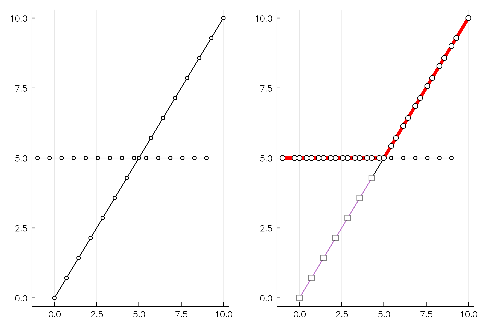
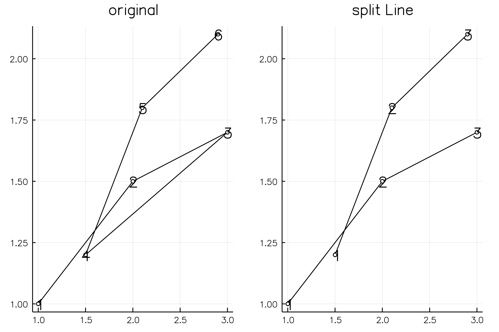

# DCEGM

Julia implementation of https://github.com/fediskhakov/dcegm

### What it does

Here are some examples of the `Envelope` type. It can split backwards-folding EGM lines and find their upper envelopes.

#### case 1

#### case 2a

#### case 2b

#### case 2c

#### case 3

#### splitting wrong EGM lines

