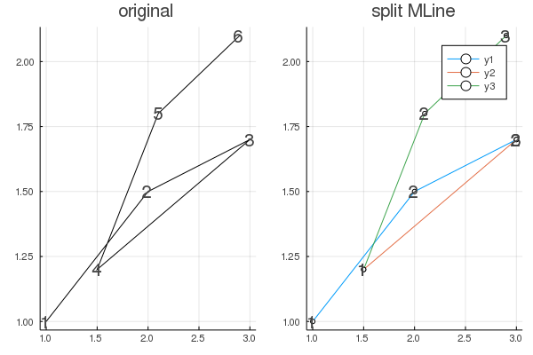

# DCEGM


[](https://travis-ci.org/floswald/DCEGM.jl)

[](https://ci.appveyor.com/project/floswald/dcegm-jl)


Julia implementation of https://github.com/fediskhakov/dcegm. In particular, this is the equivalent of his `polyline` class. It is the workhorse package behind the DCEGM algorithm. It provides the following functionality:

* Define a `MLine` as a line composed of `Point`s (x-y corrdinate pairs)
* Define an `Envelope` as a collection of `MLine`s, optionally with object `env` representing the *upper envelope* over all `MLine`s. That is just the point-wise max over all lines.
* Split `Mline`s if they are *backward bending*. This can occur if the EGM algorithm picks a wrong solution from the euler equation, caused by secondary kinks in the future value function.

## Contribution

* The main improvement over `polyline` is that here the fundamental building block is simply
    ```julia
    struct Point{T}
        x::T
        y::T
    end
    ```
    on which we define arithmetic and type promotion. 
* We can directly interpolate a `Vector{Point{T}}` (i.e. *a line*) with `Interpolations.jl` 
* It becomes *very* easy to check which points of an `MLine` are members of a constructed `Envelope`:
    ```julia
    julia> using DCEGM
    julia> n = 15
    julia> x1 = collect(range(0 , stop = 10,length = n));
    julia> x2 = collect(range(-1, stop = 9 ,length = n));
    julia> L1 = MLine(x1,x1);
    julia> L2 = MLine(x2,ones(n)*5);
    julia> e = Envelope([L1,L2]);
    julia> upper_env!(e)    # set upper envelope over L1 and L2

    # get indices of points in L2 ending up in envelope
    julia> findall( L2.v .∈ Ref(e.env.v) )  
    9-element Array{Int64,1}:
     1
     2
     3
     4
     5
     6
     7
     8
     9

    ```


### `upper_env!` in action


In this last example, consider what happens if we set `extrap = true` (the default!) on `MLine` number 3 (the green line). We would get an envelope to the left of point `x=1` that would be a linear extrapolation of the green line, probably not what we want in this case.

### `upper_env!(e::Envelope{T}; do_intersect::Bool=false)`

The package supports two modes how to treat intersections between `MLine`s. That is, either consider intersections, or don't (default). Here is a quick visual explanation:


not doing `intersect` incurs an error in that the precise intersection is not sought. We literally only connect the dots of the underlying `MLine`s. Whether this important or not depends on the use-case of a researcher. Notice that by using a sufficiently large number of points for the grids, the error becomes smaller. 
`do_intersect` is `false` by default because it is computationally relatively expensive and because there are some inconsistencies (a.k.a. bugs 🐛). This is the case for the `broken` unit test `test/Envtests.jl` line 138.


### Splitting Backward Benders

We can split backwards-folding EGM lines and find their upper envelopes.

```julia
# produces below plots
# src/plotting.jl
function splitf()
    x = [1,2,3,1.5,2.1,2.9]
    y = [1,1.5,1.7,1.2,1.8,2.1]
    L = MLine(x,y)
    p1 = plot(L,title="original",numerate=true)
    e = splitLine(L)
    p2 = plot(e,title="split MLine",numerate=true)
    plot(p1,p2)
end
```




In this last plot again realise that `extrap = false` is necessary to avoid designating the left-ward extrapolation of the blue line as the optimal `MLine` at `1.0`.
