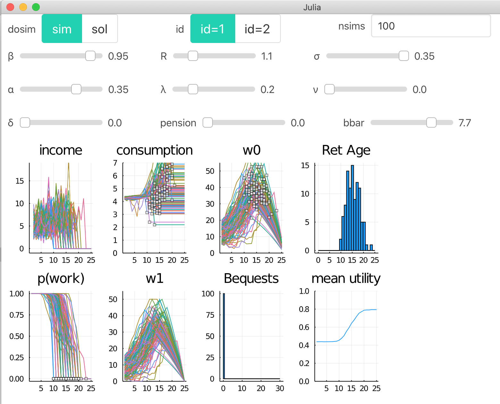

# DCEGM.jl

*This implements the code for [The endogenous grid method for discrete‐continuous dynamic choice models with (or without) taste shocks](http://onlinelibrary.wiley.com/doi/10.3982/QE643/full), published in Quantitative Economics (2017) by Fedor Iskhakov, Thomas H. Jørgensen, John Rust and Bertel Schjerning*

This julia package is based on the matlab code accompanying the published paper, available at [https://github.com/fediskhakov/dcegm](https://github.com/fediskhakov/dcegm).

**tl;dr**

1. This runs `12.5x` faster than the published matlab version. [Details](#Performance)
2. The solution is checked for numerical equivalence with the matlab version.
3. I provide a  state-dependent extensions to their version.
4. I provide interactive apps that make it easy to study model behavior as the user varies model parameters.


## How to Use this

*This package is not (yet) officially registered, you so follow instructions below for installation*

1. [Download latest julia](https://julialang.org/downloads/)
2. start julia. you see something like this:
    ```
    ➜  julia
                   _
       _       _ _(_)_     |  Documentation: https://docs.julialang.org
      (_)     | (_) (_)    |
       _ _   _| |_  __ _   |  Type "?" for help, "]?" for Pkg help.
      | | | | | | |/ _` |  |
      | | |_| | | | (_| |  |  Version 1.1.0 (2019-01-21)
     _/ |\__'_|_|_|\__'_|  |  Official https://julialang.org/ release
    |__/                   |

    julia>
    ```
3. Hit the `]` key to switch to package manager mode. the prompt switches to
    ```
    (v1.1) pkg>
    ```
4. Download this package by pasting this into the `(v1.1) pkg>` prompt and hitting enter.
    ```julia
    dev https://github.com/floswald/DCEGM.jl.git
    ```
5. After this is done, hit backspace or `ctrl-c` to go back to standard `julia>` prompt.
    ```julia
    julia> cd(joinpath(DEPOT_PATH[1],"dev","DCEGM"))  # go to the location of DCEGM on your computer
    ```
6. Go back to package mode by typing `]`. then:
    ```julia
    (v1.1) pkg> activate .     # tell pkg manager to modify current directory
    (DCEGM) pkg> instantiate    # download all dependencies
    (DCEGM) pkg> precompile     # precompile package
    ```
7. Done! :tada: Now try it out. Go back to command mode with `ctrl-c`
    ```julia
    julia> using DCEGM

    julia> @time DCEGM.runf();   # run @fedishakov's version of the model
       0.012842 seconds (13.53 k allocations: 16.122 MiB)
    ```

## Testing

The package is thoroughly unit tested. Please run `] test` while in the activated project. The main test concerns the file `test/F_test.jl`, where we test the output of this version against the one obtained from @fediskhakov s matlab version up to numerical accuracy. That is, first we save the value and policy functions from the matlab code to ASCII format on disk, then we compute the julia model, then we compare each computed value and policy function. There are many more tests, though.

```julia
# hit ]
(@v1.4) pkg> activate .
(DCEGM) pkg> test
```

## Interaction

The core of the package functionality can be tried out in an interactive dashboard powered by [`Interact.jl`](https://github.com/JuliaGizmos/Interact.jl). The relevant code is in [interact.jl](src/interact.jl).


```julia
julia> DCEGM.iminimal()   # interact with the minimal model
julia> DCEGM.iminimalb()   # interact with the minimal model with bequest
julia> DCEGM.ifedor()  # interact with fedors model
julia> DCEGM.igmodel()  # interact with the general model
```

in each instance, you'll see a new window like that one:




## Demos

A quick demonstration of how the `upper_env` method works. Given an array of `MLine`s (my version of a *line*, i.e. an array of `x-y` pairs representing a `Point`), this constructs the upper envelope over the lines. Particular attention must be paid to *intersections* between lines.


Also, points where 2 lines intersect on the initial grid of both lines are *not* intersections.


## Performance: `x12.5`

This is the output of function `bm()` which is [here](src/bench.jl). Matlab time is taken only for model solution, no setup or disk write operation. Please check the source code for questions.

```julia
julia> DCEGM.bm()
Hi! This is Matlab version 9.7.0.1261785 (R2019b) Update 3 running on my laptop
t: 25 24 23 22 21 20 19 18 17 16 15 14 13 12 11 10 9 8 7 6 5 4 3 2 1
Retirement model solved with
500 asset points
25 periods at
0.0000020 lambda  
0.350 sigma
in  1.509s
wrote policy and value function to ascii in output/ . exiting matlab.
julia timing:

BenchmarkTools.Trial: 
  memory estimate:  117.82 MiB
  allocs estimate:  179885
  --------------
  minimum time:     121.571 ms (16.45% GC)
  median time:      125.947 ms (18.26% GC)
  mean time:        129.230 ms (20.44% GC)
  maximum time:     149.955 ms (31.12% GC)
  --------------
  samples:          39
  evals/sample:     1
```

The julia version runs 12.5 times faster than the matlab version.
